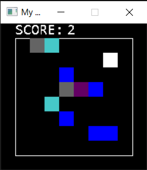

# Grid-Project-SDL2
Simple game rendered with SDL2

## What is this
A simple project for learning C++ on grid system.

## How to play
```cpp
Keyboard::Keys
W -> Move Up
S -> Move Down
A -> Move Left
D -> Move Right
SPACE -> Restart
```

## Screenshot


